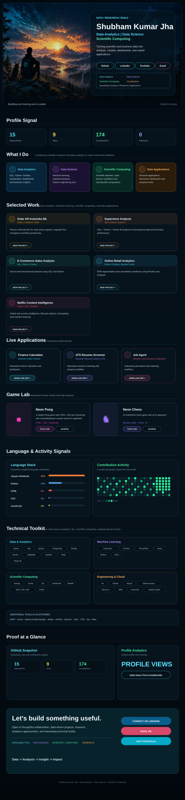

<b>Interactive profile navigation &amp; source links</b>

### Connect

[GitHub](https://github.com/shubham-k-jha) · [LinkedIn](https://www.linkedin.com/in/shubham-k-jha/) · [Portfolio](https://shubham-k-jha.github.io/) · [Email](mailto:shubhamkjha.ds@gmail.com)

### Featured projects

| Project | Repository |
|---|---|
| Solar AR Kutsenko ML | [Open repository](https://github.com/shubham-k-jha/solar-ar-kutsenko-ml) |
| Superstore Analysis | [Open repository](https://github.com/shubham-k-jha/superstore-analysis) |
| E-Commerce Sales Analysis | [Open repository](https://github.com/shubham-k-jha/ecommerce-sales-analysis) |
| Online Retail Analytics | [Open repository](https://github.com/shubham-k-jha/online-retail-analytics) |
| Netflix Content Intelligence | [Open repository](https://github.com/shubham-k-jha/netflix-content-intelligence) |

### Live applications

| App | Live | Source |
|---|---|---|
| Finance Calculator | [Open](https://finance-calc-app.streamlit.app/) | — |
| ATS Resume Screener | [Open](https://ats--resume-screener.streamlit.app/) | [GitHub](https://github.com/shubham-k-jha/ats-resume-screener) |
| Job Agent | [Open](https://job--agent.streamlit.app/) | — |

### Game lab

| Build | Live | Source |
|---|---|---|
| Neon Pong | [Play](https://shubham-k-jha.github.io/Neon-Pong) | [GitHub](https://github.com/shubham-k-jha/pong) |
| Neon Chess | [Play](https://shubham-k-jha.github.io/Neon-Chess-Chess-vs-AI/) | [GitHub](https://github.com/shubham-k-jha/Neon-Chess-Chess-vs-AI) |

### Analytics

[GitHub Profile Analytics Dashboard](https://github-profile-analytics-rho.vercel.app/dashboard.html)

