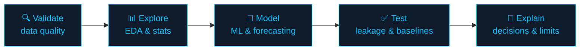

<picture>
  <source media="(prefers-color-scheme: dark)" srcset="https://capsule-render.vercel.app/api?type=waving&color=0:00C2FF,50:1b2a41,100:0d1b2a&height=200&section=header&text=Shubham%20Kumar%20Jha&fontSize=44&fontColor=ffffff&animation=fadeIn&fontAlignY=38&desc=Data%20Analyst%20%E2%80%A2%20Physics%20Researcher%20%E2%80%A2%20Data%20Scientist&descAlignY=58&descSize=18">
  <source media="(prefers-color-scheme: light)" srcset="https://capsule-render.vercel.app/api?type=waving&color=0:0d1b2a,50:1b2a41,100:00C2FF&height=200&section=header&text=Shubham%20Kumar%20Jha&fontSize=44&fontColor=ffffff&animation=fadeIn&fontAlignY=38&desc=Data%20Analyst%20%E2%80%A2%20Physics%20Researcher%20%E2%80%A2%20Data%20Scientist&descAlignY=58&descSize=18">
  
</picture>

 

🔄 Last updated: October 2026

---

## 📈 Impact at a Glance

| 🛰️ Solar data | 🔭 Active regions | 🛒 Retail lines | 🎬 Netflix weeks | 🧠 ROC-AUC |
|:-:|:-:|:-:|:-:|:-:|
| **40 GB+** SDO/HMI/AIA | **100+** analysed | **8,399** profit-tested | **10,960** observations | **0.8448** cancellation model |

---

## 🔁 How I Work

---

## ⭐ Featured Projects

| Project | What it answers | Stack |
|---|---|---|
| 🛒 [**Superstore Analysis**](https://github.com/shubham-k-jha/superstore-analysis) | Why a healthy 10.2% margin hides 50.8% of order lines losing money | SQL · Power BI |
| 🎬 [**Netflix Content Intelligence**](https://github.com/shubham-k-jha/netflix-content-analytics) | What drives Top 10 performance, with forecasting and prediction | Python · SQL · Scikit-learn |
| 💰 [**Customer Revenue & Churn**](https://github.com/shubham-k-jha/Customer-Revenue-Churn) | Revenue, retention and churn, served through an API with monitoring | Python · Forecasting · API |
| 👥 [**UCI Online Retail II**](https://github.com/shubham-k-jha/online-retail-analytics) | Which customers cancel, and which drive revenue | Pandas · PySpark · Scikit-learn |
| ☀️ [**Solar Active-Region ML**](https://github.com/shubham-k-jha/solar-ar-kutsenko-ml) | Which solar regions produce flares, explained with SHAP | XGBoost · SHAP |
| 🧾 [**E-Commerce Sales Analysis**](https://github.com/shubham-k-jha/ecommerce-sales-analysis) | Cleaning messy order data, then SQL analysis | SQL · Pandas |

| Superstore dashboard | Online Retail model results |
|:-:|:-:|
|  |  |

➡️ [**All repositories →**](https://github.com/shubham-k-jha?tab=repositories)

---

## 🚀 Live Apps

| App | What it does |
|---|---|
| 💰 [**Finance Calculator**](https://finance-calc-app.streamlit.app/) | Interactive finance calculations in a dashboard |
| 📄 [**ATS Resume Screener**](https://ats--resume-screener.streamlit.app/) | Role matching and ATS-style resume analysis |
| 🤖 [**Job Agent**](https://job--agent.streamlit.app/) | Job discovery and matching workflow |

---

## 🧰 Toolkit

<b>💻 Languages & Data</b>

 

     

<b>📊 BI & Visualisation</b>

 

    

<b>🤖 Machine Learning & Statistics</b>

 

   

<b>☁️ Apps, Cloud & Tools</b>

 

      

<b>🔭 Scientific Computing</b>

 

SunPy · Astropy · HMI · AIA · GOES · Linux workflows

---

## 📊 GitHub Stats

 

---

## 🔬 Background

Four years of physics research built the habit I bring to business data.

| Period | Role | Where |
|---|---|---|
| Aug 2025 – Present | **Junior Research Fellow, Data Analytics** | NIT Delhi |
| Aug 2022 – Apr 2025 | **Junior Research Fellow** | Indian Institute of Astrophysics, Bengaluru |
| 2020 – 2022 | **M.Sc. Physics** (CGPA 8.62 / 10) | NIT Manipur |
| 2015 – 2018 | **B.Sc. Physical Science** (CGPA 7.82 / 10) | University of Delhi |

🏅 Qualified **GATE Physics** (2022)

---

## ✍️ Writing

- 🧪 **When the model finds your formula.** A solar model's score jumped after adding one feature. It wasn't discovery. [Read more →](https://github.com/shubham-k-jha/solar-ar-kutsenko-ml)
- 📉 **Why a healthy margin can hide a loss problem.** The average looks fine, but the losses sit in specific products and discount bands. [Read more →](https://github.com/shubham-k-jha/superstore-analysis)
- 🎯 **Missing is not zero, and a good score is not a good model.** Lessons on missing data, censored windows and label leakage. [Netflix](https://github.com/shubham-k-jha/netflix-content-analytics) · [Online Retail](https://github.com/shubham-k-jha/online-retail-analytics)

---

## 🎮 Game Lab

- 🏓 [**Neon Pong**](https://shubham-k-jha.github.io/Neon-Pong/): fast Pong with scoring and mouse or keyboard controls ([source](https://github.com/shubham-k-jha/Neon-Pong))
- ♟️ [**Neon Chess**](https://shubham-k-jha.github.io/Neon-Chess-Chess-vs-AI/): chess against an AI opponent ([source](https://github.com/shubham-k-jha/Neon-Chess-Chess-vs-AI))

---

## 🎯 Now

**Learning:** Advanced Machine Learning · AI & LLMs · AI Agents · Data Engineering · Databricks · AWS · Forecasting

**Open to:** Data Analytics · Business Analytics · BI · Product Analytics · Data Science · ML Roles

---

### 🤝 Let's build something useful

📧 [shubhamkjha.ds@gmail.com](mailto:shubhamkjha.ds@gmail.com) · 💼 [LinkedIn](https://www.linkedin.com/in/shubham-k-jha/) · 🐙 [GitHub](https://github.com/shubham-k-jha) · 🌐 [Portfolio](https://shubham-k-jha.github.io/) · 📄 [Resume](https://shubham-k-jha.github.io/assets/Shubham_Kumar_Jha_CV.pdf)

<picture>
  <source media="(prefers-color-scheme: dark)" srcset="https://capsule-render.vercel.app/api?type=waving&color=0:00C2FF,100:0d1b2a&height=100&section=footer">
  <source media="(prefers-color-scheme: light)" srcset="https://capsule-render.vercel.app/api?type=waving&color=0:0d1b2a,100:00C2FF&height=100&section=footer">
  
</picture>

