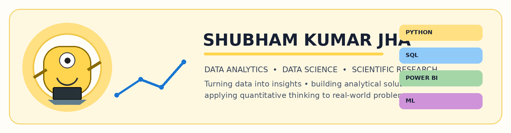

<!-- ========================================================= -->

<!--                     PROFILE HERO                          -->

<!-- ========================================================= -->

 

<h2>👋 Welcome to my GitHub</h2>

  <b>Data Analytics</b> ·
  <b>Data Science</b> ·
  <b>Scientific Research</b>

  I build data-driven projects, analytical dashboards, 
  machine-learning solutions, and scientific data applications.

 

<!-- ========================================================= -->

<!--                     QUICK LINKS                           -->

<!-- ========================================================= -->

 

 

  

<!-- ========================================================= -->

<!--                     TYPING EFFECT                         -->

<!-- ========================================================= -->

  

<!-- ========================================================= -->

<!--                     KEY SKILLS                            -->

<!-- ========================================================= -->

  
  
  
  
  

🌐 SOCIALS

👋 ABOUT ME

I work at the intersection of scientific research, data analytics and applied data science.

My background in physics and solar research has given me a strong foundation in quantitative analysis, scientific datasets, statistics, visualization, time-series analysis and reproducible computational workflows.

I am now applying that analytical approach to:

📊 Data Analytics · 🗄️ SQL · 📈 BI · 🤖 Data Science · 🐍 Python

</td>

<td width="42%" valign="top">

🎯 TARGET ROLES

DATA ANALYST
BI / BUSINESS ANALYST
RESEARCH DATA ANALYST
DATA SCIENCE
PYTHON / ANALYTICS

⚡ CURRENT FOCUS

SQL Machine Learning PySpark AWS Statistics

</td>
</tr>
</table>
---

💻 TECH STACK

                                 

      

📊 GitHub Stats:

 
 

🏆 GITHUB TROPHIES

✍️ RANDOM DEV QUOTE

🔥 FEATURED PROJECTS

<table>
<tr>
<td width="50%" valign="top">

☀️ Solar AR Kutsenko ML

Physics-informed machine learning for solar active regions, magnetic-flux emergence and flare productivity using Kutsenko catalogues, XGBoost, SHAP and statistical modelling.

STACK

Python Machine Learning XGBoost SHAP Statistics

</td>

<td width="50%" valign="top">

🛒 Superstore Analysis

Business analytics project combining SQL + Python + Power BI to analyze transactional data and produce business insights and dashboards.

STACK

SQL Python Power BI Pandas

</td>
</tr>

<tr>
<td valign="top">

🛍️ E-Commerce Sales Analysis

End-to-end transactional analysis using SQL and Python, with data exploration, aggregation and visualization.

STACK

SQL Python Pandas Matplotlib

</td>

<td valign="top">

👥 Online Retail Analytics

Analysis of the UCI Online Retail II dataset using Pandas and PySpark, including RFM customer segmentation and cancellation prediction with Random Forest.

STACK

Python Pandas PySpark Random Forest

</td>
</tr>
</table>

🚀 LIVE APPS & INTERACTIVE BUILDS

Try the work, don't just read about it.

<table>
<tr>

<td align="center" width="33%">

📈 FINANCE CALCULATOR

Streamlit · Plotly · Finance

Interactive finance calculator and dashboard.

</td>

<td align="center" width="33%">

🎯 ATS RESUME SCREENER

Streamlit · Resume Analytics · ATS

Interactive resume screening and analysis workflow.

</td>

<td align="center" width="33%">

🤖 JOB AGENT

Streamlit · Job Discovery · Automation

Interactive job-search and matching workflow.

</td>

</tr>
</table>

🎮 GAME LAB

<table>
<tr>

<td align="center" width="50%">

🏓 NEON PONG

Browser Game · JavaScript · UI

</td>

<td align="center" width="50%">

♟️ NEON CHESS

Browser Game · Chess · AI

</td>

</tr>
</table>
---

🧭 THE JOURNEY

🔬 Physics & Research → 📊 Scientific Data → 🐍 Python + SQL → 📈 Analytics & BI → 🤖 Applied Data Science

📬 LET'S CONNECT

<table width="100%">
<tr>

<td align="center" width="25%" valign="top">

💼 PROFESSIONAL

Data & Analytics

</td>

<td align="center" width="25%" valign="top">

🔬 RESEARCH

Research & Scientific Computing

</td>

<td align="center" width="25%" valign="top">

💼 LINKEDIN

Professional Network

</td>

<td align="center" width="25%" valign="top">

📄 CV

Resume / Experience

</td>

</tr>

<tr>

<td align="center" width="25%" valign="top">

🌐 PORTFOLIO

Website & Projects

</td>

<td align="center" width="25%" valign="top">

💻 GITHUB

Code & Repositories

</td>

<td align="center" width="25%" valign="top">

🏓 PONG

Neon Pong

</td>

<td align="center" width="25%" valign="top">

♟️ CHESS

Neon Chess vs AI

</td>

</tr>
</table>

 

Data Analytics · BI · Python · SQL · Scientific Data · Applied Data Science

🔝 TOP CONTRIBUTED REPOSITORIES

📊 GitHub Analytics

  
  &nbsp;
  <a href="https://github-profile-analytics-rho.vercel.app/dashboard.html">
    📈 View Analytics Dashboard
  </a>

