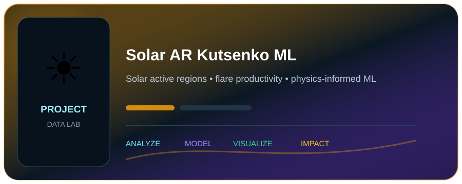
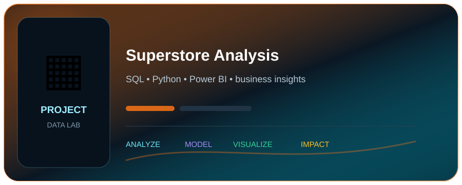
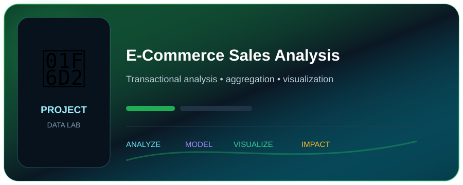
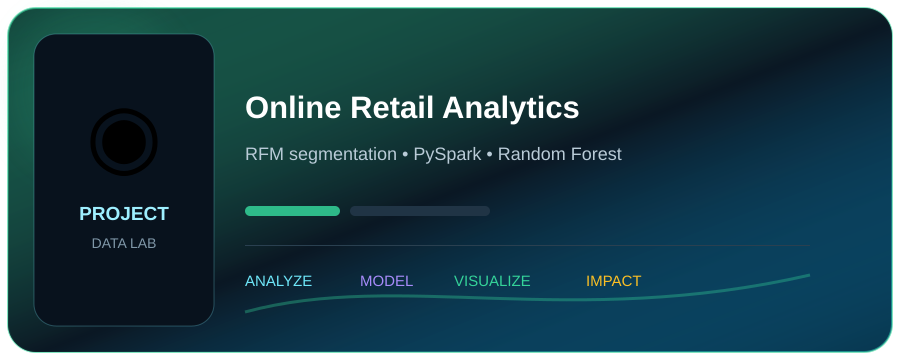
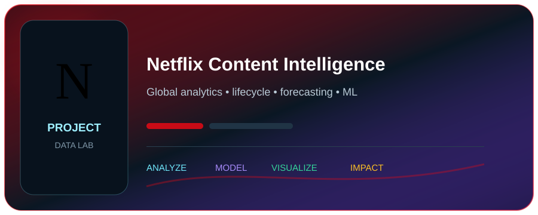
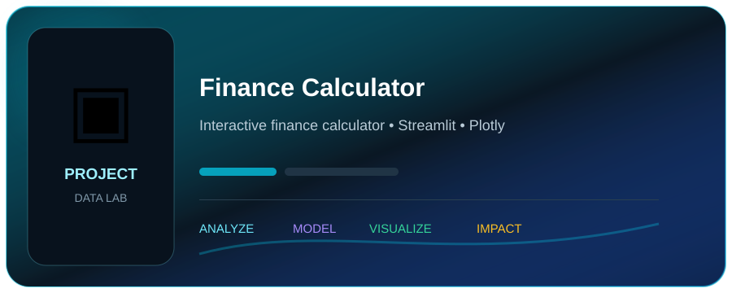
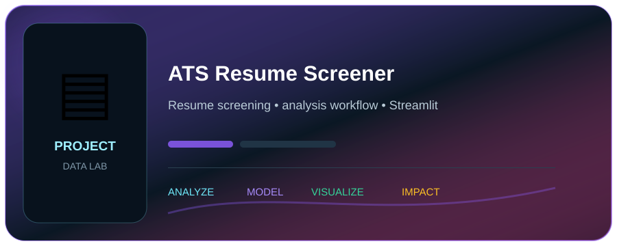
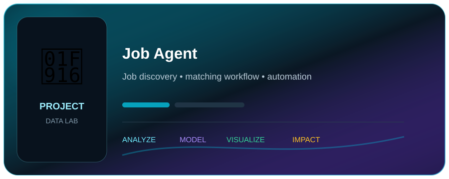
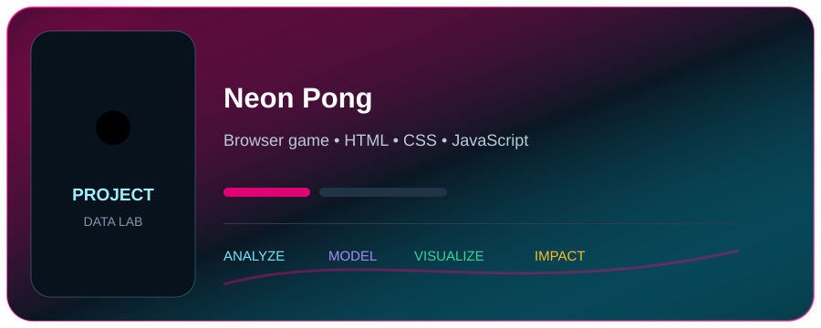
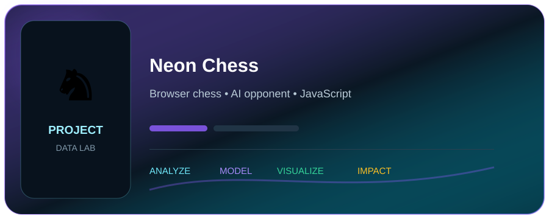

<!--
  HYBRID DESIGN
  - Native GitHub Markdown/HTML for readable, clickable content.
  - Local visual assets for the cinematic background and card art.
  - Legacy HTML background/color attributes provide a fallback if inline CSS is sanitized.
-->

<table width="100%" cellpadding="0" cellspacing="0" border="0"
       background="assets/profile-bg.jpg"
       style="background-image:url('assets/profile-bg.jpg');background-size:cover;background-position:center top;background-repeat:no-repeat;border-radius:24px;overflow:hidden;">
<tr>
<td>

<table width="100%" cellpadding="24" cellspacing="0" border="0" bgcolor="#061019">
<tr>
<td width="44%" valign="middle">

● DATA / RESEARCH / BUILD

# Shubham Kumar Jha

<b>Data Analytics · Data Science · Scientific Computing</b>

  

I build data-driven projects, analytical dashboards, 
machine-learning solutions, and scientific data applications.

  

</td>

<td width="56%" align="right" valign="middle">

</td>
</tr>
</table>

 

<!-- PROFILE SIGNAL -->
<table width="96%" align="center" cellpadding="10" cellspacing="8" border="0">
<tr>
<td colspan="4" align="center">
PROFILE SNAPSHOT · 07 OCT 2026
</td>
</tr>

<tr>
<td width="25%" bgcolor="#071923" align="center">
<b>15</b> 
Repositories
</td>

<td width="25%" bgcolor="#071923" align="center">
<b>9</b> 
Stars
</td>

<td width="25%" bgcolor="#071923" align="center">
<b>174</b> 
Contributions
</td>

<td width="25%" bgcolor="#071923" align="center">
<b>0</b> 
Followers
</td>
</tr>
</table>

 

<!-- WHAT I DO -->
<table width="96%" align="center" cellpadding="18" cellspacing="8" border="0" bgcolor="#06151E">
<tr>
<td colspan="4">
◉ <b>WHAT I DO</b>
&nbsp;&nbsp;
Combining scientific research and data analytics to solve real-world problems.
</td>
</tr>

<tr>

<td width="25%" valign="top" bgcolor="#071B2A">
<b>▥ Data Analytics</b>  
SQL, Python, Pandas, visualization, dashboards and business insights.
</td>

<td width="25%" valign="top" bgcolor="#10162A">
<b>◈ Data Science</b>  
Machine learning, statistical analysis, feature engineering and predictive modelling.
</td>

<td width="25%" valign="top" bgcolor="#06201E">
<b>✣ Scientific Computing</b>  
Quantitative research, scientific datasets, solar physics workflows and reproducible computation.
</td>

<td width="25%" valign="top" bgcolor="#211A0A">
<b>▦ Data Applications</b>  
Streamlit applications, interactive dashboards, analytical tools and data-driven interfaces.
</td>

</tr>
</table>

 

<!-- SELECTED WORK -->
<table width="96%" align="center" cellpadding="18" cellspacing="0" border="1" bordercolor="#1C4454" bgcolor="#061019">
<tr>
<td>
<b>◆ SELECTED WORK</b> 
Business analytics, machine learning, scientific computing, and data products.
</td>
<td align="right">

</td>
</tr>
</table>

 

<table width="96%" align="center" cellpadding="8" cellspacing="8" border="0">
<tr>

<td width="20%" valign="top">
 
<b>Solar AR Kutsenko ML</b> 
Physics-informed ML for solar active regions, magnetic-flux emergence and flare productivity.  
<code>Python</code> <code>XGBoost</code> <code>SHAP</code> 
<a href="https://github.com/shubham-k-jha/solar-ar-kutsenko-ml">View project →</a>
</td>

<td width="20%" valign="top">
 
<b>Superstore Analysis</b> 
SQL + Python + Power BI analysis of transactional data and business performance.  
<code>SQL</code> <code>Python</code> <code>Power BI</code> 
<a href="https://github.com/shubham-k-jha/superstore-analysis">View project →</a>
</td>

<td width="20%" valign="top">
 
<b>E-Commerce Sales Analysis</b> 
End-to-end transactional analysis using SQL and Python.  
<code>SQL</code> <code>Python</code> <code>Pandas</code> 
<a href="https://github.com/shubham-k-jha/ecommerce-sales-analysis">View project →</a>
</td>

<td width="20%" valign="top">
 
<b>Online Retail Analytics</b> 
RFM segmentation and cancellation prediction using Pandas and PySpark.  
<code>Python</code> <code>PySpark</code> <code>Random Forest</code> 
<a href="https://github.com/shubham-k-jha/online-retail-analytics">View project →</a>
</td>

<td width="20%" valign="top">
 
<b>Netflix Content Intelligence</b> 
Global and country intelligence, lifecycle analysis, forecasting and machine learning.  
<code>Python</code> <code>SQL</code> <code>Streamlit</code> 
<a href="https://github.com/shubham-k-jha/netflix-content-intelligence">View project →</a>
</td>

</tr>
</table>

 

<!-- LIVE APPS -->
<table width="96%" align="center" cellpadding="18" cellspacing="0" border="1" bordercolor="#1C4454" bgcolor="#061019">
<tr>
<td>
<b>ϟ LIVE APPLICATIONS</b> 
Try the work, don't just read about it.
</td>
<td align="right">

</td>
</tr>
</table>

 

<table width="96%" align="center" cellpadding="8" cellspacing="8" border="0">
<tr>

<td width="33%" valign="top">
 
<b>Finance Calculator</b> 
Interactive finance calculator and dashboard. 
<code>Streamlit</code> <code>Plotly</code> <code>Finance</code>  

</td>

<td width="33%" valign="top">
 
<b>ATS Resume Screener</b> 
Interactive resume screening and analysis workflow. 
<code>Streamlit</code> <code>Resume Analytics</code> <code>ATS</code>  

&nbsp;

</td>

<td width="33%" valign="top">
 
<b>Job Agent</b> 
Interactive job-search and matching workflow. 
<code>Streamlit</code> <code>Job Discovery</code> <code>Automation</code>  

</td>

</tr>
</table>

 

<!-- GAMES -->
<table width="96%" align="center" cellpadding="18" cellspacing="0" border="1" bordercolor="#1C4454" bgcolor="#061019">
<tr>
<td>
<b>⌁ GAME LAB</b> 
A small side collection of interactive browser builds.
</td>
</tr>
</table>

 

<table width="96%" align="center" cellpadding="8" cellspacing="8" border="0">
<tr>

<td width="50%" valign="top">
 
<b>Neon Pong</b> 
A simple Pong game built with HTML, CSS and JavaScript with mouse/keyboard controls and an AI opponent.  
<a href="https://shubham-k-jha.github.io/Neon-Pong">▶ Play Live</a>
&nbsp;·&nbsp;
<a href="https://github.com/shubham-k-jha/pong">Source Code</a>
</td>

<td width="50%" valign="top">
 
<b>Neon Chess</b> 
A fully interactive chess game with an AI opponent.  
<a href="https://shubham-k-jha.github.io/Neon-Chess-Chess-vs-AI/">▶ Play Live</a>
&nbsp;·&nbsp;
<a href="https://github.com/shubham-k-jha/Neon-Chess-Chess-vs-AI">Source Code</a>
</td>

</tr>
</table>

 

<!-- LANGUAGE + ACTIVITY -->
<table width="96%" align="center" cellpadding="18" cellspacing="8" border="0">
<tr>

<td width="48%" valign="top" bgcolor="#06151E">

<b>▣ LANGUAGE STACK</b> 
Repository-weighted technologies  

</td>

<td width="52%" valign="top" bgcolor="#06151E">

<b>▤ CONTRIBUTION ACTIVITY</b> 
GitHub activity signal  

</td>

</tr>
</table>

 

<!-- TOOLKIT -->
<table width="96%" align="center" cellpadding="18" cellspacing="0" border="1" bordercolor="#1C4454" bgcolor="#061019">
<tr>
<td>
<b>⚙ TECHNICAL TOOLKIT</b> 
Core technologies, scientific tooling, engineering, cloud and supporting platforms.
</td>
</tr>
</table>

 

<table width="96%" align="center" cellpadding="12" cellspacing="8" border="0">

<tr>
<td width="25%" valign="top" bgcolor="#071B2A">
<b>DATA & ANALYTICS</b>  
Python · SQL · MySQL · SQLite · Pandas · NumPy · Matplotlib · Plotly · Power BI
</td>

<td width="25%" valign="top" bgcolor="#10162A">
<b>MACHINE LEARNING</b>  
scikit-learn · PyTorch · TensorFlow · Keras · MLflow · SciPy
</td>

<td width="25%" valign="top" bgcolor="#06201E">
<b>SCIENTIFIC COMPUTING</b>  
Astropy · SunPy · IDL · DAVE4VM · SHARP · SDO/AIA/HMI · GOES
</td>

<td width="25%" valign="top" bgcolor="#211A0A">
<b>ENGINEERING & CLOUD</b>  
Git · GitHub · GitLab · GitHub Actions · GitLab CI · AWS · Anaconda · Apache Spark
</td>
</tr>

<tr>
<td colspan="4" bgcolor="#071019">
<b>ADDITIONAL TOOLS & PLATFORMS</b>  
GIMP · Canva · Adobe Acrobat Reader · Adobe · NVIDIA · OpenGL · Xbox · TOR · Jira · Meta
</td>
</tr>

</table>

 

<!-- GITHUB PROOF -->
<table width="96%" align="center" cellpadding="18" cellspacing="0" border="1" bordercolor="#1C4454" bgcolor="#061019">
<tr>
<td>
<b>◌ GITHUB PROOF</b> 
Live profile signals and contribution history.  

</td>
</tr>
</table>

 

<!-- ANALYTICS -->
<table width="96%" align="center" cellpadding="18" cellspacing="0" border="1" bordercolor="#1C4454" bgcolor="#061019">
<tr>
<td width="55%">
<b>◉ PROFILE SIGNAL</b> 
GitHub profile views tracked by my analytics service.  

</td>

<td width="45%" align="center">

</td>
</tr>
</table>

 

<!-- CTA -->
<table width="96%" align="center" cellpadding="22" cellspacing="0" border="1" bordercolor="#1C4454" bgcolor="#08202A">
<tr>
<td width="60%">
<b>Let's build something useful.</b>  

Open to thoughtful collaboration, data-driven projects, research, analytics opportunities,
and interesting technical builds.

</td>

<td width="40%" align="center">

  

  

</td>
</tr>
</table>

 

<table width="96%" align="center" cellpadding="10" cellspacing="0" border="0">
<tr>
<td align="center">
Data Analytics &nbsp;|&nbsp; Data Science &nbsp;|&nbsp; Scientific Computing &nbsp;|&nbsp; Research &nbsp;|&nbsp; Visualization
</td>
</tr>
</table>

</td>
</tr>
</table>

 

**Data → Analysis → Insight → Impact**

