


 

  

<b>Data analyst with a physics research background.</b> 
I've worked with 40 GB of SDO/HMI/AIA solar data, and more than 500 GB of SDO/HMI data across 100+ active regions. I bring the same habit to business data: validate first, then trust the result. Currently studying advanced machine learning, AI and statistics.

<a href="https://shubham-k-jha.github.io/">Portfolio</a> · <a href="https://shubham-k-jha.github.io/#writing">Writing</a> · <a href="https://shubham-k-jha.github.io/assets/Shubham_Kumar_Jha_CV.pdf">CV (PDF)</a> · <a href="mailto:shubhamkjha.ds@gmail.com">Email</a>

  

  

 


  

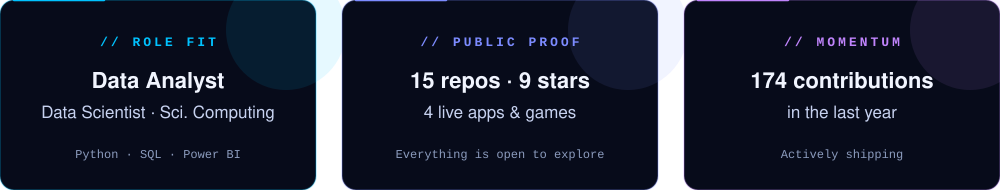

 

 

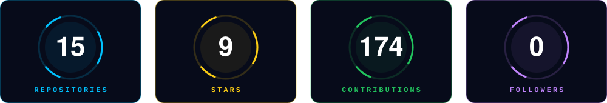

 

 

<a href="https://github.com/shubham-k-jha/solar-ar-kutsenko-ml">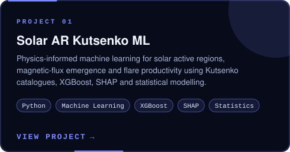</a>
<a href="https://github.com/shubham-k-jha/superstore-analysis">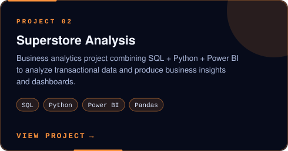</a>

<a href="https://github.com/shubham-k-jha/ecommerce-sales-analysis">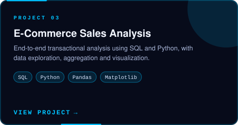</a>
<a href="https://github.com/shubham-k-jha/online-retail-analytics">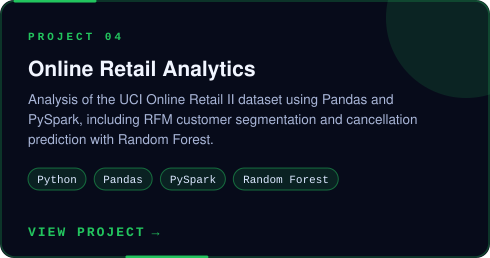</a>

<a href="https://github.com/shubham-k-jha/netflix-content-analytics">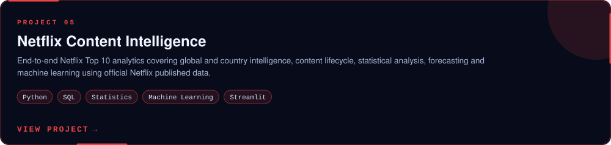</a>

<a href="https://github.com/shubham-k-jha/Customer-Revenue-Churn">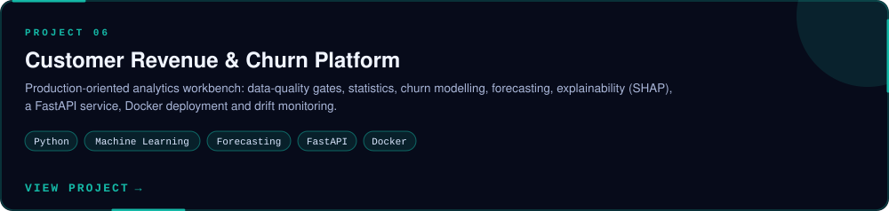</a>

 

<a href="https://github.com/shubham-k-jha/superstore-analysis">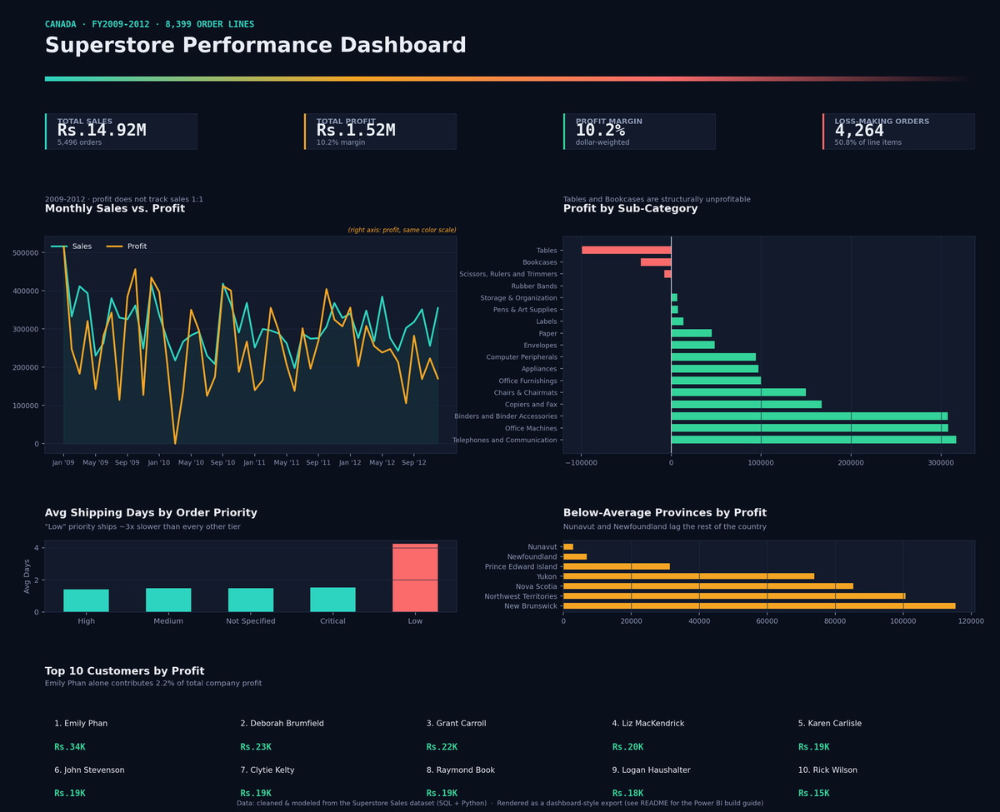</a>

<i>Superstore dashboard: Tables and Bookcases lose money, and low-priority orders ship about three times slower.</i>

 

<i>Try the work, don't just read about it.</i>

 

<a href="https://finance-calc-app.streamlit.app/">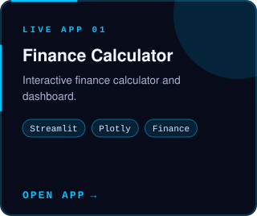</a>
<a href="https://ats--resume-screener.streamlit.app/">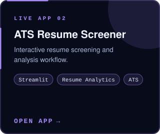</a>
<a href="https://job--agent.streamlit.app/">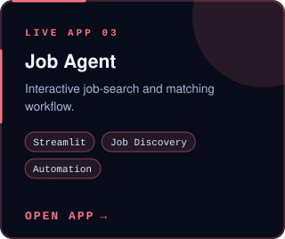</a>

 

 

 

<a href="https://shubham-k-jha.github.io/Neon-Pong">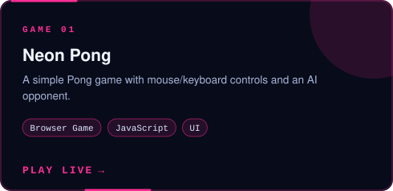</a>
<a href="https://shubham-k-jha.github.io/Neon-Chess-Chess-vs-AI/">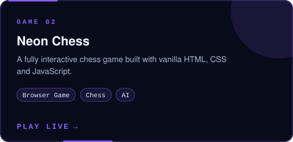</a>

 

  

 


 

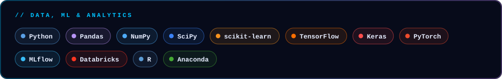

 

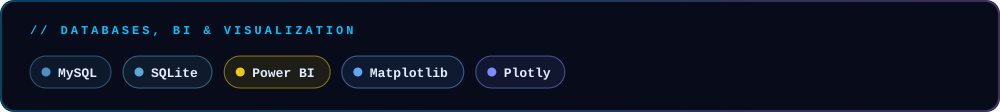

 

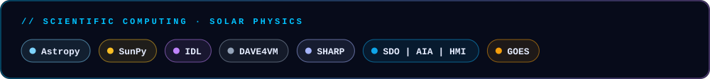

 

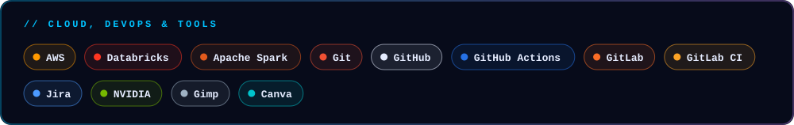

<b>Toolkit as plain text</b>

**Python and data:** Python, Pandas, NumPy, SciPy, PySpark  
**SQL:** MySQL, PostgreSQL, SQLite, CTEs, window functions  
**BI and visualisation:** Power BI, DAX, Tableau, Excel, Matplotlib, Seaborn, Plotly  
**Machine learning:** Scikit-learn, XGBoost, SHAP, forecasting  
**Statistics:** hypothesis and A/B testing, inference, time series  
**Scientific computing:** SunPy, Astropy, HMI, AIA and GOES data, Linux  
**Tools:** Git, GitHub, Streamlit, FastAPI, Docker, AWS fundamentals

 

 

<i>Open to thoughtful teams, ambitious products, and useful data and engineering work.</i>

  

  

&nbsp;
<a href="https://github-profile-analytics-rho.vercel.app/dashboard.html">📈 View Analytics Dashboard</a>

  

