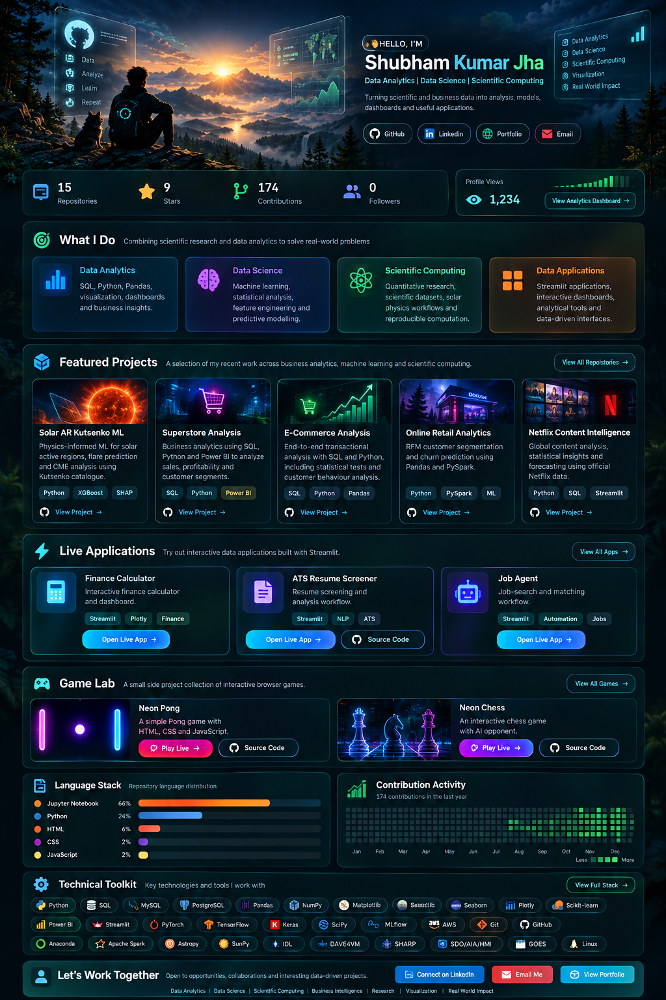

 

&nbsp;

&nbsp;

&nbsp;

---

## Profile

**Shubham Kumar Jha** works at the intersection of **Data Analytics, Data Science, Scientific Computing, and Research Data Analysis**.

The profile covers Python, SQL, Power BI, machine learning, statistics, visualization, scientific datasets, solar research, analytical applications, and reproducible computational workflows.

### Featured work

- [Solar AR Kutsenko ML](https://github.com/shubham-k-jha/solar-ar-kutsenko-ml)
- [Superstore Analysis](https://github.com/shubham-k-jha/superstore-analysis)
- [E-Commerce Sales Analysis](https://github.com/shubham-k-jha/ecommerce-sales-analysis)
- [Online Retail Analytics](https://github.com/shubham-k-jha/online-retail-analytics)
- [Netflix Content Intelligence](https://github.com/shubham-k-jha/netflix-content-intelligence)

### Live applications

- [Finance Calculator](https://finance-calc-app.streamlit.app/)
- [ATS Resume Screener](https://ats--resume-screener.streamlit.app/)
- [Job Agent](https://job--agent.streamlit.app/)

### Interactive builds

- [Neon Pong — Live](https://shubham-k-jha.github.io/Neon-Pong) · [Source](https://github.com/shubham-k-jha/pong)
- [Neon Chess — Live](https://shubham-k-jha.github.io/Neon-Chess-Chess-vs-AI/) · [Source](https://github.com/shubham-k-jha/Neon-Chess-Chess-vs-AI)

### Analytics

[GitHub Profile Analytics Dashboard](https://github-profile-analytics-rho.vercel.app/dashboard.html)

---

**Data → Analysis → Insight → Impact**

