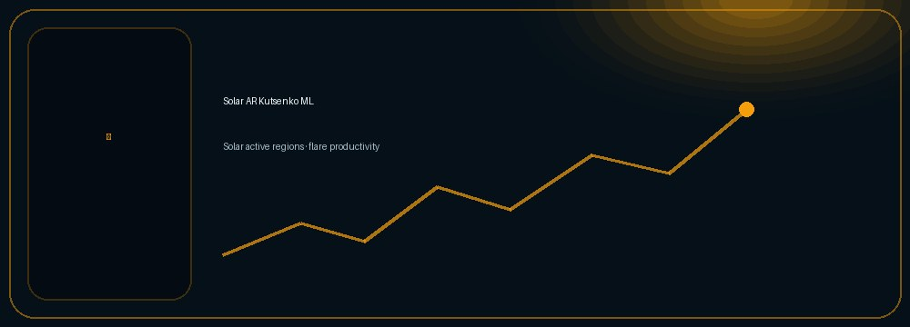
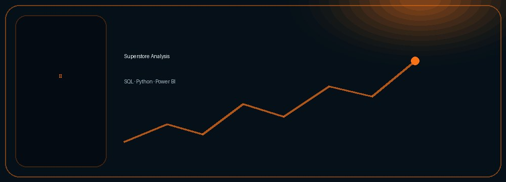
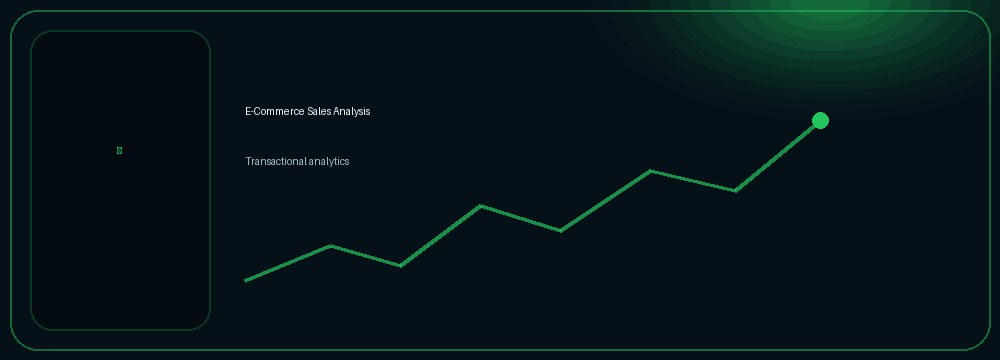
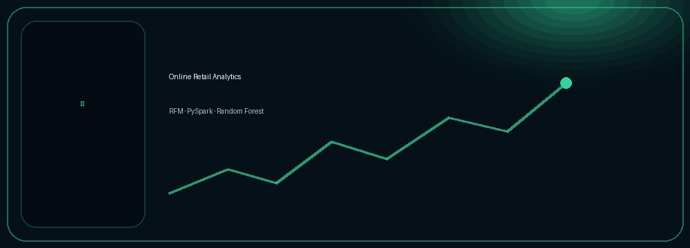
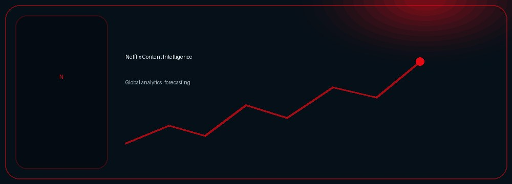
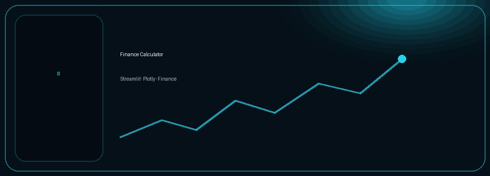
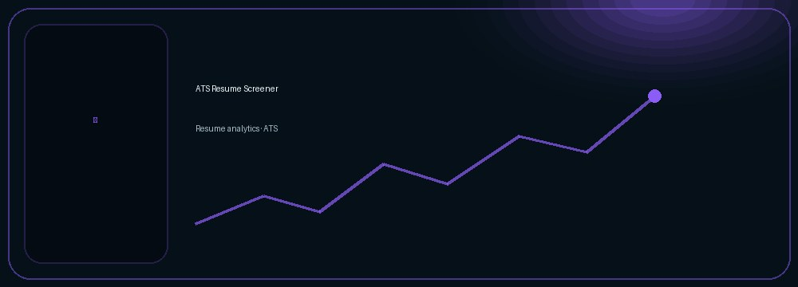
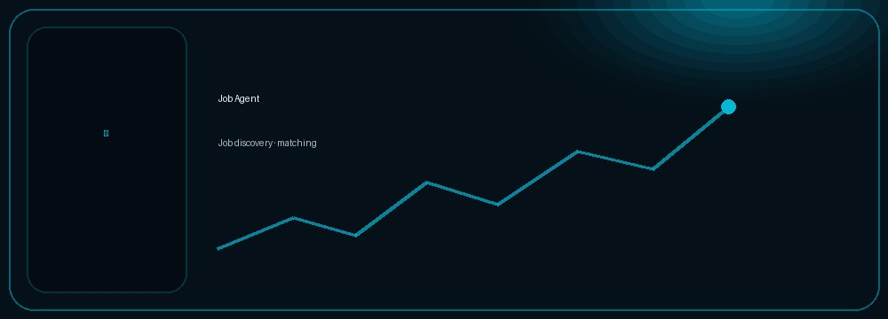
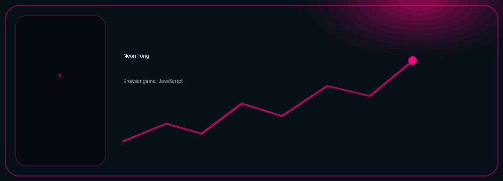
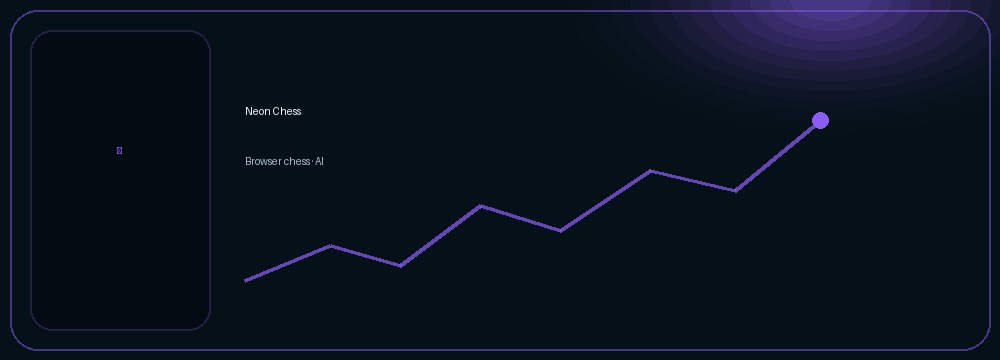

<table width="100%" cellpadding="0" cellspacing="0" border="0"
       background="assets/page-environment.jpg">

<tr>
<td>

<!-- ========================================================= -->
<!-- HERO: REAL TEXT + REAL LINKS, ON TOP OF THE ENVIRONMENT -->
<!-- ========================================================= -->

<table width="96%" align="center" cellpadding="28" cellspacing="0" border="0">
<tr>
<td width="58%" valign="middle">

● DATA · RESEARCH · BUILD

# Shubham Kumar Jha

<b>Data Analytics · Data Science · Scientific Computing</b>

 

I build data-driven projects, analytical dashboards, 
machine-learning solutions, and scientific data applications.

  

</td>

<td width="42%" align="right" valign="middle">

</td>
</tr>
</table>

 

<!-- ========================================================= -->
<!-- PROFILE SIGNAL -->
<!-- ========================================================= -->

<table width="92%" align="center" cellpadding="18" cellspacing="8" border="0">
<tr>

<td width="25%" align="center" bgcolor="#06131D">
<b>15</b> 
Repositories
</td>

<td width="25%" align="center" bgcolor="#06131D">
<b>9</b> 
Stars
</td>

<td width="25%" align="center" bgcolor="#06131D">
<b>174</b> 
Contributions
</td>

<td width="25%" align="center" bgcolor="#06131D">
<b>0</b> 
Followers
</td>

</tr>
</table>

 

<!-- ========================================================= -->
<!-- WHAT I DO -->
<!-- ========================================================= -->

<table width="92%" align="center" cellpadding="20" cellspacing="0" border="0">
<tr>
<td bgcolor="#06131D">

<b>◉ WHAT I DO</b>
&nbsp;&nbsp;
Scientific research + data analytics + applied data science.

  

<table width="100%" cellpadding="14" cellspacing="7" border="0">
<tr>

<td width="25%" valign="top" bgcolor="#071C2A">
<b>▥ Data Analytics</b>  
SQL, Python, Pandas, visualization, dashboards and business insights.
</td>

<td width="25%" valign="top" bgcolor="#11152B">
<b>◈ Data Science</b>  
Machine learning, statistical analysis, feature engineering and predictive modelling.
</td>

<td width="25%" valign="top" bgcolor="#06231F">
<b>✣ Scientific Computing</b>  
Quantitative research, scientific datasets, solar physics workflows and reproducible computation.
</td>

<td width="25%" valign="top" bgcolor="#241B0B">
<b>▦ Data Applications</b>  
Streamlit applications, interactive dashboards, analytical tools and data-driven interfaces.
</td>

</tr>
</table>

</td>
</tr>
</table>

 

<!-- ========================================================= -->
<!-- SELECTED WORK -->
<!-- ========================================================= -->

<table width="92%" align="center" cellpadding="20" cellspacing="0" border="0">
<tr>
<td bgcolor="#06131D">

<b>◆ SELECTED WORK</b> 
A selection of analytical, machine-learning and scientific projects.

  

<table width="100%" cellpadding="8" cellspacing="8" border="0">

<tr>

<td width="20%" valign="top" bgcolor="#07131D">
  
<b>Solar AR Kutsenko ML</b> 
Physics-informed ML for solar active regions, magnetic-flux emergence and flare productivity.  
<code>Python</code> <code>XGBoost</code> <code>SHAP</code> 
<a href="https://github.com/shubham-k-jha/solar-ar-kutsenko-ml">View project →</a>
</td>

<td width="20%" valign="top" bgcolor="#07131D">
  
<b>Superstore Analysis</b> 
SQL + Python + Power BI analysis of transactional data and business performance.  
<code>SQL</code> <code>Python</code> <code>Power BI</code> 
<a href="https://github.com/shubham-k-jha/superstore-analysis">View project →</a>
</td>

<td width="20%" valign="top" bgcolor="#07131D">
  
<b>E-Commerce Sales Analysis</b> 
End-to-end transactional analysis using SQL and Python.  
<code>SQL</code> <code>Python</code> <code>Pandas</code> 
<a href="https://github.com/shubham-k-jha/ecommerce-sales-analysis">View project →</a>
</td>

<td width="20%" valign="top" bgcolor="#07131D">
  
<b>Online Retail Analytics</b> 
RFM segmentation and cancellation prediction using Pandas and PySpark.  
<code>Python</code> <code>PySpark</code> <code>Random Forest</code> 
<a href="https://github.com/shubham-k-jha/online-retail-analytics">View project →</a>
</td>

<td width="20%" valign="top" bgcolor="#07131D">
  
<b>Netflix Content Intelligence</b> 
Global and country intelligence, content lifecycle, forecasting and machine learning.  
<code>Python</code> <code>SQL</code> <code>Streamlit</code> 
<a href="https://github.com/shubham-k-jha/netflix-content-intelligence">View project →</a>
</td>

</tr>
</table>

</td>
</tr>
</table>

 

<!-- ========================================================= -->
<!-- LIVE APPLICATIONS -->
<!-- ========================================================= -->

<table width="92%" align="center" cellpadding="20" cellspacing="0" border="0">
<tr>
<td bgcolor="#06131D">

<b>ϟ LIVE APPLICATIONS</b> 
Try the work, don't just read about it.

  

<table width="100%" cellpadding="8" cellspacing="8" border="0">
<tr>

<td width="33%" valign="top" bgcolor="#07131D">
  
<b>Finance Calculator</b> 
Interactive finance calculator and dashboard.  
<code>Streamlit</code> <code>Plotly</code> <code>Finance</code>  
<a href="https://finance-calc-app.streamlit.app/">🚀 Open live app →</a>
</td>

<td width="33%" valign="top" bgcolor="#07131D">
  
<b>ATS Resume Screener</b> 
Interactive resume screening and analysis workflow.  
<code>Streamlit</code> <code>Resume Analytics</code> <code>ATS</code>  
<a href="https://ats--resume-screener.streamlit.app/">🚀 Open live app →</a>
&nbsp; <a href="https://github.com/shubham-k-jha/ats-resume-screener">Source →</a>
</td>

<td width="33%" valign="top" bgcolor="#07131D">
  
<b>Job Agent</b> 
Interactive job-search and matching workflow.  
<code>Streamlit</code> <code>Job Discovery</code> <code>Automation</code>  
<a href="https://job--agent.streamlit.app/">🚀 Open live app →</a>
</td>

</tr>
</table>

</td>
</tr>
</table>

 

<!-- ========================================================= -->
<!-- GAME LAB -->
<!-- ========================================================= -->

<table width="92%" align="center" cellpadding="20" cellspacing="0" border="0">
<tr>
<td bgcolor="#06131D">

<b>⌁ GAME LAB</b> 
Interactive browser experiments and side builds.

  

<table width="100%" cellpadding="8" cellspacing="8" border="0">
<tr>

<td width="50%" valign="top" bgcolor="#07131D">
  
<b>Neon Pong</b> 
A simple Pong game built with HTML, CSS and JavaScript with mouse/keyboard controls and an AI opponent.  
<a href="https://shubham-k-jha.github.io/Neon-Pong">▶ Play live</a>
&nbsp;·&nbsp;
<a href="https://github.com/shubham-k-jha/pong">Source</a>
</td>

<td width="50%" valign="top" bgcolor="#07131D">
  
<b>Neon Chess</b> 
A fully interactive chess game built with HTML, CSS and JavaScript with an AI opponent.  
<a href="https://shubham-k-jha.github.io/Neon-Chess-Chess-vs-AI/">▶ Play live</a>
&nbsp;·&nbsp;
<a href="https://github.com/shubham-k-jha/Neon-Chess-Chess-vs-AI">Source</a>
</td>

</tr>
</table>

</td>
</tr>
</table>

 

<!-- ========================================================= -->
<!-- LANGUAGE + ACTIVITY -->
<!-- ========================================================= -->

<table width="92%" align="center" cellpadding="20" cellspacing="8" border="0">
<tr>

<td width="48%" valign="top" bgcolor="#06131D">

<b>▣ LANGUAGE STACK</b> 
Repository-weighted language distribution.  

</td>

<td width="52%" valign="top" bgcolor="#06131D">

<b>▤ CONTRIBUTION ACTIVITY</b> 
GitHub contribution history.  

</td>

</tr>
</table>

 

<!-- ========================================================= -->
<!-- TOOLKIT -->
<!-- ========================================================= -->

<table width="92%" align="center" cellpadding="20" cellspacing="0" border="0">
<tr>
<td bgcolor="#06131D">

<b>⚙ TECHNICAL TOOLKIT</b> 
The tools and technologies represented in my work.

  

<table width="100%" cellpadding="12" cellspacing="7" border="0">

<tr>
<td width="25%" valign="top" bgcolor="#071C2A">
<b>DATA & ANALYTICS</b>  
Python · SQL · MySQL · SQLite · Pandas · NumPy · Matplotlib · Plotly · Power BI
</td>

<td width="25%" valign="top" bgcolor="#11152B">
<b>MACHINE LEARNING</b>  
scikit-learn · PyTorch · TensorFlow · Keras · MLflow · SciPy
</td>

<td width="25%" valign="top" bgcolor="#06231F">
<b>SCIENTIFIC COMPUTING</b>  
Astropy · SunPy · IDL · DAVE4VM · SHARP · SDO/AIA/HMI · GOES
</td>

<td width="25%" valign="top" bgcolor="#241B0B">
<b>ENGINEERING & CLOUD</b>  
Git · GitHub · GitLab · GitHub Actions · GitLab CI · AWS · Anaconda · Apache Spark
</td>
</tr>

<tr>
<td colspan="4" bgcolor="#07131D">
<b>ADDITIONAL TOOLS</b>  
GIMP · Canva · Adobe Acrobat Reader · Adobe · NVIDIA · OpenGL · Xbox · TOR · Jira · Meta
</td>
</tr>

</table>

</td>
</tr>
</table>

 

<!-- ========================================================= -->
<!-- GITHUB PROOF -->
<!-- ========================================================= -->

<table width="92%" align="center" cellpadding="20" cellspacing="0" border="0">
<tr>
<td bgcolor="#06131D">

<b>◌ PROOF AT A GLANCE</b> 
Dynamic GitHub profile signals.  

</td>
</tr>
</table>

 

<!-- ========================================================= -->
<!-- ANALYTICS -->
<!-- ========================================================= -->

<table width="92%" align="center" cellpadding="20" cellspacing="0" border="0">
<tr>

<td width="60%" bgcolor="#06131D">
<b>◉ PROFILE SIGNAL</b> 
GitHub profile views tracked by my analytics service.  

</td>

<td width="40%" align="center" bgcolor="#06131D">

</td>

</tr>
</table>

 

<!-- ========================================================= -->
<!-- FINAL CTA -->
<!-- ========================================================= -->

<table width="92%" align="center" cellpadding="26" cellspacing="0" border="0">
<tr>

<td width="62%" bgcolor="#08202A">
<b>Let's build something useful.</b>  

Open to thoughtful collaboration, data-driven projects, research,
analytics opportunities, and interesting technical builds.

</td>

<td width="38%" align="center" bgcolor="#08202A">

  

  

</td>
</tr>
</table>

  

Data Analytics &nbsp;|&nbsp; Data Science &nbsp;|&nbsp; Scientific Computing &nbsp;|&nbsp; Research &nbsp;|&nbsp; Visualization

  

<b>Data → Analysis → Insight → Impact</b>

  

</td>
</tr>
</table>

